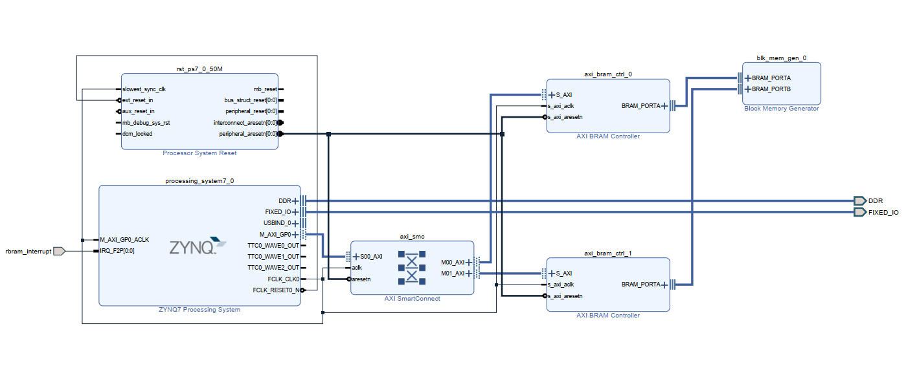
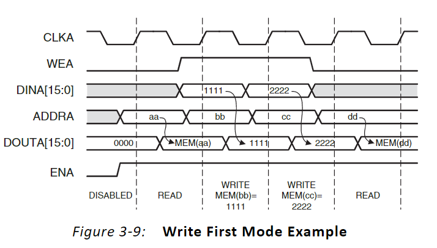

# 
ZYNQ: Write/Read between PS &PL

### Part 1 - Block Diagram

### Part 2 - Operating Mode

`Content from Xilinx PG058`

**Write First Mode:** In WRITE_FIRST mode, the input data is simultaneously written into memory and driven on the data output, as shown in Figure 3-9. This transparent mode offers the flexibility of using the data output bus during a Write operation on the same port.

**Write/Read from PS through AXI BRAM Controller:**

Address = XPAR_AXI_BRAM_CTRL_1_S_AXI_BASEADDR (PS Offset)+ BRAM_ADDR

**Write/Read Directly to BRAM through BRAM_PORT through PL:**

Address =  BRAM_ADDR

